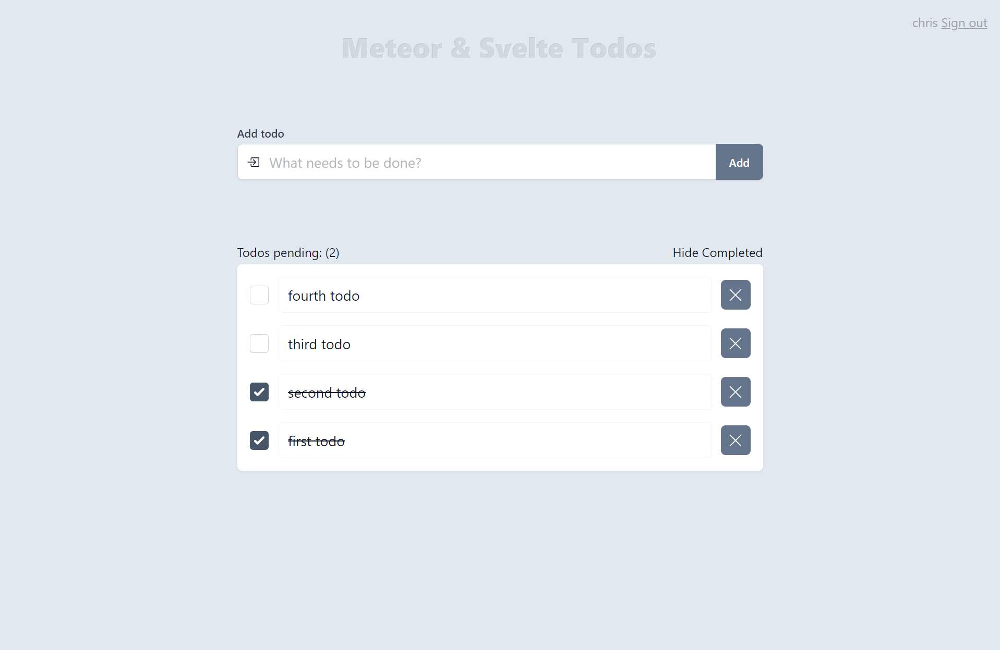

# Meteor & Svelte Todos

A simple but beautiful todos app using Meteor, Svelte and Tailwind CSS.



## Features

- Add todos
    - By pressing the Add button
    - By pressing `Enter` key while the caret is in todo item input field
    - Won't add todo item if the todo item input field is empty
    - Keeps caret focus in add todo input field for quick succession of adding todo items
- Update todos
    - Update todo item on blur or by pressing Enter key
- Delete todos
    - By pressing `X` (delete) button
    - By having an empty todo item input field on blur or by pressing `Enter` key
- Hide and show completed todos
- Pending todos count
- Reactive data
- Beautiful UI

## TODO
- [ ] Remove the Meteor insecure package and define methods
- [ ] Remove the Meteor autopublish package and define publications
- [ ] Add user authentication using Meteor
- [ ] When added, todos are attached to a user id
- [ ] Only allow users to view their own todos
- [ ] Ability to add description to a todo
- [ ] Ability to add tags to a todo

## Give it a whirl

Once you've cloned or downloaded the project, then start a development server:

```bash
meteor run
```